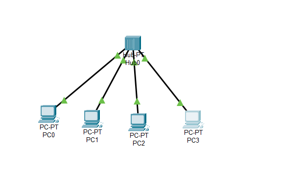

# Bus Topology using Cisco Packet Tracer

## 📌 Objective
- Simulate a **Bus Topology** using a Hub in Cisco Packet Tracer.  
- Connect multiple PCs to a shared backbone (Hub).  
- Assign static IP addresses and test connectivity using `ping`.

---

## 🏗️ Network Topology
  


---

## ⚙️ Devices Used
- 1 × Hub (Hub-PT)  
- 4 × PCs (PC0, PC1, PC2, PC3)  
- Copper Straight-Through Cables  

---

## 🔧 Configuration Steps
1. **Drag and drop devices:**
   - Place 1 Hub and 4 PCs on the workspace.
2. **Connect devices:**
   - Use Copper Straight-Through cables to connect each PC (FastEthernet0) to the Hub ports.
3. **Assign IP Addresses (Desktop → IP Config):**
   - PC0: `192.168.1.2 / 255.255.255.0`
   - PC1: `192.168.1.3 / 255.255.255.0`
   - PC2: `192.168.1.4 / 255.255.255.0`
   - PC3: `192.168.1.5 / 255.255.255.0`
   - (No Default Gateway needed since there is no router).

---

## ✅ Verification
- From **PC0**, open Command Prompt and test:
  ```bash
  ping 192.168.1.3
  ping 192.168.1.4
  ping 192.168.1.5


---

## 📚 Learning Outcome

Understood how a Bus Topology works (simulated using a Hub).

Observed that all devices share the same communication medium.

Learned that a single hub failure disrupts the entire network.

Saw how collisions can occur when multiple devices transmit simultaneously.

---


## ❌ Why Bus Topology is Rejected Today

Scalability issues: Adding more devices decreases performance.

Collision domain: Only one device can transmit at a time; collisions are frequent.

Single point of failure: If the backbone cable or hub fails, the entire network goes down.

Low security: All data travels across the same medium; any device can "listen" to others’ traffic.

Replaced by Star/Switch-based topologies which are faster, more reliable, and scalable.