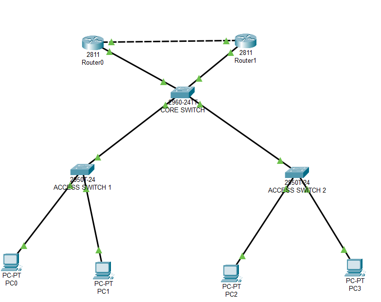

# Hybrid Topology using Cisco Packet Tracer 🔀

## 📌 Objective
- Simulate a **Hybrid Topology** in Cisco Packet Tracer.  
- Combine multiple network topologies (Star + Mesh in this case).  
- Demonstrate how enterprises use a mix of designs for scalability and redundancy.  

---

## 🏗️ Network Topology
  
  

---

## ⚙️ Devices Used
- 1 × Core Switch  
- 2 × Access Switches (Star part)  
- 4 × PCs (connected to access switches)  
- 2 × Routers (Mesh part, connected to core for redundancy)  
- Copper Straight-Through Cables (PC ↔ Switch)  
- Copper Cross-Over or Serial Cables (Router ↔ Router)  

---

## 📋 IP Addressing Plan

| Device | Interface         | IP Address    | Subnet Mask   |
|--------|-------------------|---------------|---------------|
| PC1    | Fa0               | 192.168.10.2  | 255.255.255.0 |
| PC2    | Fa0               | 192.168.10.3  | 255.255.255.0 |
| PC3    | Fa0               | 192.168.20.2  | 255.255.255.0 |
| PC4    | Fa0               | 192.168.20.3  | 255.255.255.0 |
| Router0| Fa0/0 (to Core)    | 10.0.1.1      | 255.255.255.252 |
| Router1| Fa0/0 (to Core)    | 10.0.1.2      | 255.255.255.252 |
| Router0| Fa0/1 (to Router1) | 10.0.2.1      | 255.255.255.252 |
| Router1| Fa0/1 (to Router0) | 10.0.2.2      | 255.255.255.252 |

*(VLANs can be created on the Core Switch to segment PC1/PC2 and PC3/PC4)*  

---

## 🔧 Configuration Steps

### 1. Build the Topology
- Core Switch in the center.  
- Access Switch1 ↔ PC1, PC2 (Star branch).  
- Access Switch2 ↔ PC3, PC4 (Star branch).  
- Core Switch ↔ Router0 and Router1.  
- Router0 ↔ Router1 (Mesh redundancy link).  

### 2. Assign IP addresses
- Configure IPs on PCs as per plan.  
- Assign IPs on router interfaces.  

## Router0 Configuration

    enable
    configure terminal
    !
    interface fa0/0
    ip address 192.168.10.1 255.255.255.0
    no shutdown
    !
    interface fa0/1
    ip address 10.0.1.1 255.255.255.252
    no shutdown
    !
    interface fa0/2
    ip address 10.0.2.1 255.255.255.252
    no shutdown
    !
    router rip
    version 2
    network 192.168.10.0
    network 10.0.1.0
    network 10.0.2.0
    no auto-summary
    end
    write memory

## Router1 Configuration

    enable
    configure terminal
    !
    interface fa0/0
    ip address 192.168.20.1 255.255.255.0
    no shutdown
    !
    interface fa0/1
    ip address 10.0.1.2 255.255.255.252
    no shutdown
    !
    interface fa0/2
    ip address 10.0.2.2 255.255.255.252
    no shutdown
    !
    router rip
    version 2
    network 192.168.20.0
    network 10.0.1.0
    network 10.0.2.0
    no auto-summary
    end
    write memory

## 🔌 Physical Connections

Core to Access Switches

- Core Sw Fa0/1 ↔ Access Sw1 Fa0/1 (Straight-Through)

- Core Sw Fa0/2 ↔ Access Sw2 Fa0/1 (Straight-Through)

Access Switch1 ↔ PCs

- PC1 (Fa0) ↔ Access Sw1 (Fa0/2)

- PC2 (Fa0) ↔ Access Sw1 (Fa0/3)

Access Switch2 ↔ PCs

- PC3 (Fa0) ↔ Access Sw2 (Fa0/2)

- PC4 (Fa0) ↔ Access Sw2 (Fa0/3)

Core Switch ↔ Routers

- Core Sw Fa0/4 ↔ Router0 Fa0/0 (Straight-Through)

- Core Sw Fa0/5 ↔ Router1 Fa0/0 (Straight-Through)

Router ↔ Router (Redundancy Link)

- Router0 Fa0/1 ↔ Router1 Fa0/1 (Cross-Over Cable)

## ✅ Testing & Verification

PC to PC Communication

- From PC1, ping PC2 → ping 192.168.10.3

- From PC3, ping PC4 → ping 192.168.20.3

Inter-VLAN Communication via Routers

- From PC1, ping PC3 → ping 192.168.20.2

- From PC2, ping PC4 → ping 192.168.20.3

Router Redundancy Test

Shutdown Router0 Fa0/1 (shutdown) → Check if traffic reroutes via Router1.

Restore Router0 and repeat for Router1 to validate redundancy.