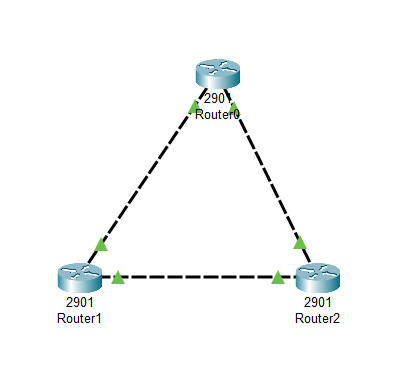

# 3-Router Mesh Topology using Cisco Packet Tracer

## 📌 Objective
- Build a **Mesh Topology** using 3 Routers in Cisco Packet Tracer.  
- Assign IP addresses on point-to-point links.  
- Verify connectivity using `ping`.  

---

## 🏗️ Network Topology
  
 

---

## ⚙️ Devices Used
- 3 × Routers (Router0, Router1, Router2)  
- Copper Cross-Over Cables (for Router-to-Router links)  

---

## 📋 IP Addressing Plan
We use **/30 subnets** for point-to-point links:

| Link          | Subnet       | Router A IP  | Router B IP  |
|---------------|--------------|--------------|--------------|
| R0 ↔ R1       | 10.0.1.0/30  | R0: 10.0.1.1 | R1: 10.0.1.2 |
| R1 ↔ R2       | 10.0.2.0/30  | R1: 10.0.2.1 | R2: 10.0.2.2 |
| R2 ↔ R0       | 10.0.3.0/30  | R2: 10.0.3.1 | R0: 10.0.3.2 |

---

## 🔧 Configuration Steps

### 🖥️ Router0
```bash
    enable
    configure terminal
    !
    interface gigabitEthernet 0/0
    ip address 10.0.1.1 255.255.255.252
    no shutdown
    !
    interface gigabitEthernet 0/1
    ip address 10.0.3.2 255.255.255.252
    no shutdown
    end
    write memory


### 🖥️ Router1
```bash
    enable
    configure terminal
    !
    interface gigabitEthernet 0/0
    ip address 10.0.1.2 255.255.255.252
    no shutdown
    !
    interface gigabitEthernet 0/1
    ip address 10.0.2.1 255.255.255.252
    no shutdown
    end
    write memory

---

### 🖥️ Router2
```bash
    enable
    configure terminal
    !
    interface gigabitEthernet 0/0
    ip address 10.0.2.2 255.255.255.252
    no shutdown
    !
    interface gigabitEthernet 0/1
    ip address 10.0.3.1 255.255.255.252
    no shutdown
    end
    write memory

---

## ✅ Verification

    From Router0:
    ping 10.0.1.2   # Router1
    ping 10.0.3.1   # Router2
    From Router1:
    ping 10.0.1.1   # Router0
    ping 10.0.2.2   # Router2
    From Router2:
    ping 10.0.2.1   # Router1
    ping 10.0.3.2   # Router0

Successful replies ✅ confirm the mesh is working.

## 📚 Learning Outcome

Understood how a Mesh Topology works with 3 routers.

Configured IP addressing on point-to-point router links.

Verified direct router-to-router communication.

## 🌟 Advantages

Provides redundancy (if one link fails, others can still carry traffic).

No single point of failure in a triangle mesh.

Demonstrates real-world WAN/ISP connectivity concepts.

## ❌ Disadvantages

Limited scalability — more routers require more interfaces.

Cabling and configuration complexity grows quickly.