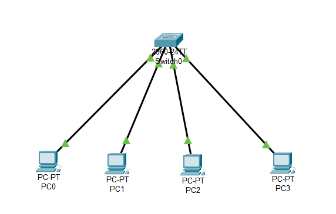

# Star Topology using Cisco Packet Tracer

## 📌 Objective
- Simulate a **Star Topology** using a Switch in Cisco Packet Tracer.  
- Connect multiple PCs to a central switch.  
- Assign static IP addresses and test connectivity using `ping`.

---

## 🏗️ Network Topology
  


---

## ⚙️ Devices Used
- 1 × Switch (2960-24TT)  
- 4 × PCs (PC0, PC1, PC2, PC3)  
- Copper Straight-Through Cables  

---

## 🔧 Configuration Steps
1. **Drag and drop devices:**
   - Place 1 Switch and 4 PCs on the workspace.
2. **Connect devices:**
   - Use Copper Straight-Through cables to connect each PC (FastEthernet0) to the Switch ports (F0/1, F0/2, F0/3, F0/4).
3. **Assign IP Addresses (Desktop → IP Config):**
   - PC0: `192.168.1.2 / 255.255.255.0`
   - PC1: `192.168.1.3 / 255.255.255.0`
   - PC2: `192.168.1.4 / 255.255.255.0`
   - PC3: `192.168.1.5 / 255.255.255.0`
   - (No Default Gateway needed unless a router is added).

---

## ✅ Verification
- From **PC0**, open Command Prompt and test:
  ```bash
  ping 192.168.1.3
  ping 192.168.1.4
  ping 192.168.1.5

---

## 📚 Learning Outcome

Understood how a Star Topology works (centralized with a Switch).

Learned that each device has a dedicated link to the switch.

Observed that communication is more efficient compared to Bus Topology.

---

## 🌟 Advantages

Easy to install and manage.

High reliability — failure of one PC does not affect others.

Switch reduces collisions (each port is its own collision domain).

Scalable — new devices can be easily added.

---

## ❌ Disadvantages

Central device (Switch/Hub) is a single point of failure — if it fails, the whole network goes down.

Requires more cable length compared to Bus Topology.

---

## 💡 Why Star Topology is Popular Today

Performance: Switches allow full-duplex communication and reduce collisions.

Scalability: Easy to expand by adding more devices.

Security: Easier to implement monitoring and access control.

Reliability: Local failures don’t affect the whole network.